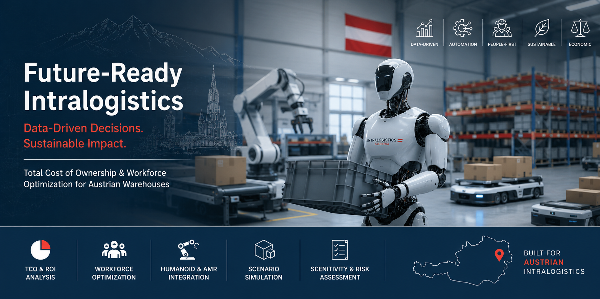
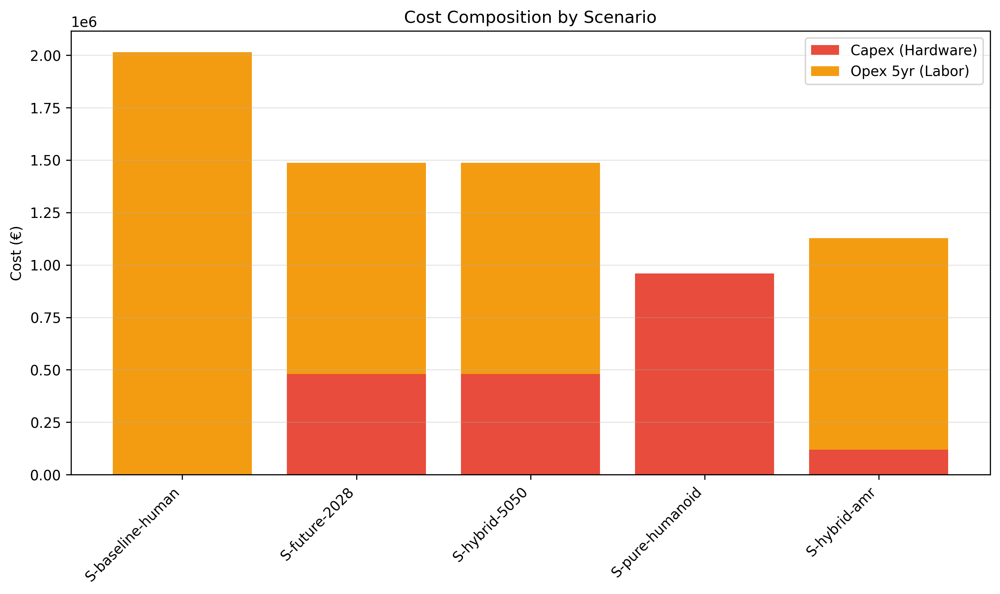
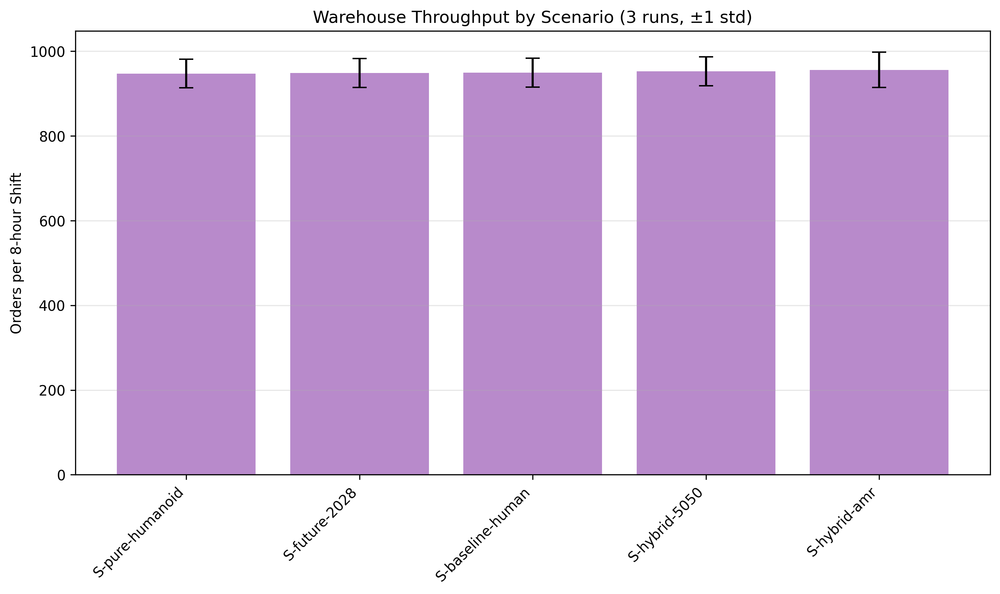
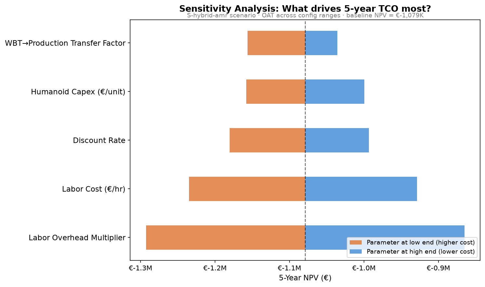
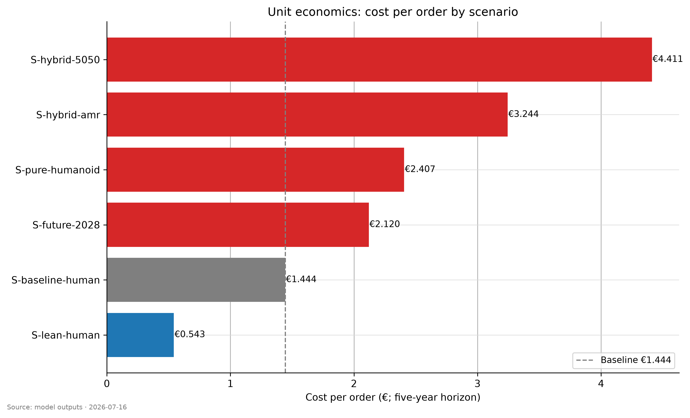

# warehouse_humanoid_tco



[](https://github.com/RafaelBraga-Kribitz/warehouse_humanoid_tco/actions/workflows/ci.yml)
[](https://github.com/RafaelBraga-Kribitz/warehouse_humanoid_tco/actions/workflows/reproducibility.yml)

A reproducible analytical framework for the Total Cost of Ownership of humanoid robots in Austrian intralogistics, built as a Data Analytics / Business Intelligence portfolio project.

> **All authoritative project information lives in [📋 PROJECT_CHARTER.md](./PROJECT_CHARTER.md).** This README intentionally does not duplicate it. If you want the goals, scope, requirements, design decisions, or anything else about the project, open the Charter.

## Demo


## What it does

Extracts humanoid robot task capabilities from the open Unitree UnifoLM-WBT dataset, simulates an AutoStore-style warehouse with configurable workforce mixes (human, humanoid, AMR), computes Total Cost of Ownership over 5 years using Austrian labor cost inputs, and publishes results to Tableau Public and Power BI. The entire pipeline is reproducible; the entire methodology is documented.

## Quick start

```bash
# Clone
git clone https://github.com/RafaelBraga-Kribitz/warehouse_humanoid_tco.git
cd warehouse_humanoid_tco

# Install dependencies (one-time)
uv venv .venv
source .venv/bin/activate
uv pip install -e ".[dev]"

# Run the de-risk notebook (Module 0)
jupytext --to ipynb notebooks/00_derisk_dataset_inspection.py
jupyter notebook notebooks/00_derisk_dataset_inspection.ipynb

# Run the full pipeline
make all
```

**For users without `uv`:** Generate a requirements.txt from `uv.lock`:
```bash
uv export --format requirements-txt > requirements.txt
pip install -r requirements.txt
```

## Results Summary

**Pipeline Status:** ✓ All modules complete with real data (2026-05-21). Modules 1–3 executed on 2,359 real humanoid episodes from Unitree UnifoLM datasets.

### Data

- **2,359 episodes** extracted from 5 UnifoLM datasets (WBT + DiverseManip)
- **Capabilities profiled:** cycle time, reach, energy, success rate by task category
- **Multi-label taxonomy:** every episode is tagged with all applicable categories (avg 2.29 labels/episode; 1,750 / 2,359 = 74% multi-labeled). Coverage: `pick_medium_object` 2,359 · `place_general` 1,750 · `transport_short` 757 · `bimanual_handling` 525 episodes
- **Provenance:** every claim about dataset accessibility, episode counts, and SHA-pinned revisions traces to [`reports/derisk_inspection_report.json`](./reports/derisk_inspection_report.json) (the Module 0 de-risk audit, run before pipeline execution). This is the single authoritative source for "what data is real vs. synthetic" in this project.
- **Validation:** Full data profiling notebook in [📊 notebooks/01_data_profile_summary.ipynb](./notebooks/01_data_profile_summary.ipynb) (stakeholder transparency)

### Simulation

- **75 runs total** across 5 warehouse scenarios (15 replicas per scenario)
- **Scenarios:** baseline human, pure humanoid, hybrid (50/50), hybrid + AMR, future 2028
- **Metrics:** orders per shift, queue length, utilization (with 90% CI across runs)

### Financial Analysis (5-year horizon, 8% discount)


| Scenario         | NPV             | Capex      | Opex 5yr      | Cost/Order |
| ---------------- | --------------- | ---------- | ------------- | ---------- |
| S-baseline-human | €-1,608,251     | €0         | €2,013,984    | €1.344     |
| S-hybrid-5050    | €-1,576,941     | €532K      | €1,308,562    | €1.314     |
| S-pure-humanoid  | €-1,545,632     | €1,064K    | €603,139      | €1.295     |
| S-future-2028    | €-1,398,599     | €409K      | €1,238,969    | €1.170     |
| **S-hybrid-amr** | **€-1,078,786** | **€198K**  | **€1,102,993**| **€0.895** |


**Under the modeled assumptions, S-hybrid-amr minimizes 5-year TCO by ~33% vs. the human baseline.** Annual opex now includes humanoid maintenance (8% of capex), energy, and a 0.10 FTE supervision overhead per humanoid; AMR scenarios also include AMR capex and opex. This advantage is sensitive to humanoid capex: at >€180K/unit the advantage narrows significantly (see sensitivity tornado chart below). Pure-humanoid reaches cost-parity with the human baseline at ≤€125,865/unit capex (current: €120K → €5.8K headroom; see `reports/module_03_tco_report.json::breakeven_thresholds`). Results assume a 70% WBT-to-production transfer factor; see §2A in PROJECT_CHARTER.md for the rationale.

> **Real data execution:** Results computed from 2,359 episodes across 5 Unitree UnifoLM datasets (WBT + DiverseManip). Financial model uses 15 simulation replicas per scenario with Austrian labor cost inputs (€18.50/hr + 1.35× overhead).

### Sensitivity Analysis

- **Monte Carlo (10,000 runs × 5 scenarios = 50,000 samples, all persisted):** S-hybrid-amr NPV mean = €-1,089,021 ± €171,407 (1σ); median = €-1,079,103
  - 90% output interval (p5–p95): [€-1,386,257, €-830,291]
  - Per-scenario MC with **agent counts fixed**; samples only continuous params: humanoid capex, labor wage, labor overhead, discount rate, WBT→production transfer factor (5 parameters)
  - S-hybrid-amr is the only scenario whose worst case (p5 = €-1.39M) still beats the baseline mean (€-1.62M); its entire 90% interval [€-1.39M, €-830K] sits above the baseline expectation — it is robustly the cheapest under uncertainty
- **OAT Tornado:** Labor variables dominate — overhead swing €542K + wage swing €388K = €930K combined labor sensitivity vs €258K for humanoid capex and €204K for transfer factor (~3.6× labor:capex ratio at full config ranges)

#### Executive Charts

| Chart | View | Data |
|-------|------|------|
| **NPV Ranking** |  | [📥 01_tco_npv_ranking.png](./reports/executive_charts/01_tco_npv_ranking.png) |
| **Cost Breakdown** |  | [📥 02_cost_breakdown.png](./reports/executive_charts/02_cost_breakdown.png) |
| **Capacity Ceiling** |  | [📥 03_simulation_throughput.png](./reports/executive_charts/03_simulation_throughput.png) |
| **Sensitivity Tornado** |  | [📥 04_sensitivity_tornado.png](./reports/executive_charts/04_sensitivity_tornado.png) |
| **Cost per Order** |  | [📥 05_cost_per_order.png](./reports/executive_charts/05_cost_per_order.png) |

**Full Report:** [📄 reports/sensitivity_analysis_report.json](./reports/sensitivity_analysis_report.json)

### Dashboards

- **[Tableau Public Dashboard](https://public.tableau.com/app/profile/rafael.braga.kribitz/viz/HumanoidRoboticsTCO/Dashboard1)** — Interactive TCO, simulation, and capabilities analysis
- **Power BI:** exported data ready for `.pbix` creation ([`exports/tableau_public/`](./exports/tableau_public/))

## For Recruiters

**Austrian hiring managers:** → **[Kurzfassung auf Deutsch](./reports/Executive_Summary_DE.qmd)** — Analyse unter österreichischen Kollektivvertragslöhnen und Betriebsratsanforderungen

**What this shows:**

1. ✓ Data pipeline rigor: end-to-end extraction, validation, profiling
2. ✓ Statistical modeling: SimPy discrete-event simulation with empirical cycle times from 2,359 UnifoLM episodes; scenario differentiation constrained by low system utilization (120 orders/hr arrival vs. 500–1150 orders/hr capacity); see ADR-0007 for agent routing bug fix
3. ✓ Financial analysis: NPV, sensitivity, payback period for business decisions
4. ✓ Reproducibility: every result is version-controlled and auditable

**How to explore:**

1. Read [📋 PROJECT_CHARTER.md](./PROJECT_CHARTER.md) for methodology + assumptions
2. Review [📊 notebooks/01_data_profile_summary.ipynb](./notebooks/01_data_profile_summary.ipynb) for data validation
3. Check [📁 reports/](./reports/) for Module 0–4 validation reports
4. View [📈 executive_charts/](./reports/executive_charts/) (NPV, Cost, Throughput, Sensitivity, Cost/Order)
5. View the live dashboard: [📊 Tableau Public](https://public.tableau.com/app/profile/rafael.braga.kribitz/viz/HumanoidRoboticsTCO/Dashboard1) or browse [📊 exports/tableau_public/](./exports/tableau_public/) (CSVs for local BI import)

## Documentation Entry Points

| Document | Purpose |
|----------|---------|
| [📋 PROJECT_CHARTER.md](./PROJECT_CHARTER.md) | **SSOT.** Goals, scope, requirements, decisions, change log |
| [📝 CONTRIBUTING.md](./CONTRIBUTING.md) | Discipline rules: ADRs, Markdown allowlist, coding standards |
| [🏛️ docs/ADR/](./docs/ADR/) | Architecture Decision Records (append-only log) |
| [📊 reports/](./reports/) | Audit + validation reports + executive charts (all modules) |
| [📊 notebooks/01_data_profile_summary.ipynb](./notebooks/01_data_profile_summary.ipynb) | Data validation + stakeholder transparency |
| [📐 docs/data_lineage.md](./docs/data_lineage.md) | Pipeline data flow diagram (Mermaid) |
| [📈 reports/executive_charts/](./reports/executive_charts/) | 5 finalized business charts (ranking, cost, throughput, sensitivity, cost/order) |

## Why this project

I live 20 minutes from Knapp AG's headquarters and wanted to understand what operations analysts there are actually evaluating when they look at humanoid robot integration in 2026; not the hype cycle, but the unit economics. 

The biggest surprise was how much the sensitivity analysis depends on headcount assumptions rather than robot capex: if you have 8 workers and replace 1.6 of them with 1.6 humanoids, the labor savings math is almost entirely driven by how many human FTEs you actually need, not by whether the robot costs €100K or €180K. 

The second surprise was the 3× variance in cycle time across task categories in the real UnifoLM data — pick tasks are far noisier than place tasks, which makes the hybrid-AMR advantage fragile in some scenarios. With more time I would calibrate against actual Knapp throughput benchmarks rather than public estimates, and add a proper learning curve for humanoid performance over the first 12 months of deployment.

## License

[📄 MIT](./LICENSE)

## Author

Rafael Braga-Kribitz, Seiersberg-Pirka, Austria. Portfolio project, 2026.