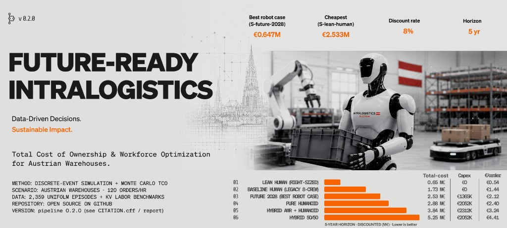
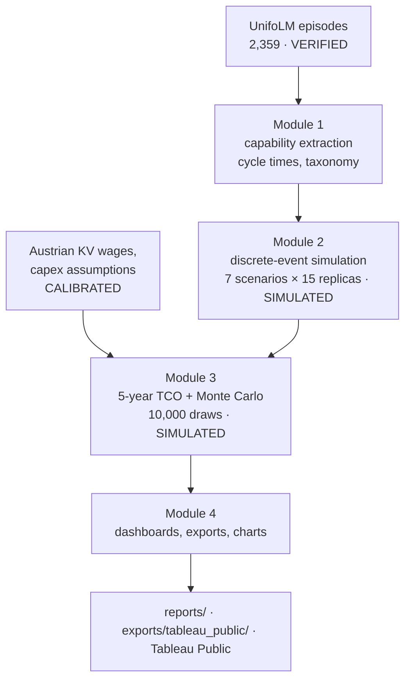

# Warehouse Humanoid TCO



[](https://github.com/RafaelBraga-Kribitz/warehouse_humanoid_tco/actions/workflows/ci.yml)
[](https://github.com/RafaelBraga-Kribitz/warehouse_humanoid_tco/actions/workflows/reproducibility.yml)
[](https://www.python.org/downloads/release/python-3110/)
[](LICENSE)
[](governance/AUDIT_PROCEDURE.md)
[](#status)

**Status:** Complete

When do humanoid robots beat human labor in warehouse economics? A reproducible decision-analysis framework — discrete-event simulation + Monte Carlo [TCO](./docs/glossary.md#tco) on 2,359 real robot episodes and Austrian labor costs. Reproducibility here means the documented pipeline and weekly CI determinism check ([`reproducibility.yml`](./.github/workflows/reproducibility.yml)); the committed [reproduction log](./governance/REPRODUCTION_LOG.md) is an agent surrogate (F-230), not a completed third-party stranger-clone verification.

> **SSOT:** [PROJECT_CHARTER.md](./PROJECT_CHARTER.md). Methodology ADRs: [governance/adrs/](./governance/adrs/).

## Decision summary

> **Recommendation:** deploy S-lean-hybrid-amr now (1 human + 3 AMRs) and defer humanoid procurement: no pure-humanoid capex in the searched €10,000–€500,000 range reaches parity with this frontier lean mix at 120 orders/hr — even near-free humanoids lose to 1H+3A, so capex is not the binding constraint; revisit under demand growth, labor scarcity, or multi-shift operation (see `reports/demand_frontier.json`). Integration cost and availability derating are modeled (F-222). <!-- claim: reports/module_03_tco_report.json::breakeven_thresholds.vs_lean_human.no_breakeven_in_search_range -->

At modeled demand, **S-lean-hybrid-amr** is the cheapest ρ-feasible scenario (€0.453M five-year present-value cost; 1 human + 3 AMRs from the demand frontier). **S-lean-human** (3 humans, €0.647M) remains the human-only comparator. The retained eight-human row is a labelled legacy-overstaffed reference, not a fair technology baseline. Of the humanoid-inclusive scenarios, S-future-2028 is lowest cost (€2.533M) but remains costlier than the human baseline. In Austrian intralogistics the practical automation driver is unfillable vacancies, not wage arbitrage; this model conservatively assumes labor is available at KV rates, so robot value is understated wherever vacancies go unfilled. <!-- claim: reports/module_03_tco_report.json::scenario_results[5].npv_eur [eur_m]; claim: reports/module_03_tco_report.json::scenario_results[4].npv_eur [eur_m]; claim: reports/module_03_tco_report.json::scenario_results[1].npv_eur [eur_m] -->


## See it running


*`make all` runs Modules 1–4 (capability extraction → simulation → TCO → dashboards) and writes every chart and table quoted on this page to `reports/` and `exports/`. Recording: [`docs/assets/demo.cast`](./docs/assets/demo.cast).*

Interactive view: [Tableau Public dashboard](https://public.tableau.com/app/profile/rafael.braga.kribitz/viz/HumanoidRoboticsTCO/Dashboard1), fed from the CSVs in [`exports/tableau_public/`](./exports/tableau_public/).

## Explore this project

| Persona | Path |
|---------|------|
| **Recruiter (2 min)** | [DE PDF](./reports/Executive_Summary_DE.pdf) · [EN PDF](./reports/Executive_Summary_EN.pdf) · [Exhibit deck](./reports/exhibit_deck.pdf) · [Tableau Public](https://public.tableau.com/app/profile/rafael.braga.kribitz/viz/HumanoidRoboticsTCO/Dashboard1) · [60s walkthrough](./docs/walkthrough_60s.md) |
| **Hiring manager (10 min)** | [Decision box above](#decision-summary) · [EXPERIMENTS verdicts](./governance/EXPERIMENTS.md) · [data lineage](./docs/data_lineage.md) · [LIMITATIONS](./governance/LIMITATIONS.md) |
| **Auditor** | [governance/](./governance/README.md) · [AUDIT_STATE](./governance/AUDIT_STATE.json) · [QUALITY_BLUEPRINT](./governance/QUALITY_BLUEPRINT.md) |

## Results

**Pipeline:** Modules 1–3 on 2,359 UnifoLM episodes. Hypotheses: [`governance/EXPERIMENTS.md`](./governance/EXPERIMENTS.md).

### Data

- **2,359 episodes** from 5 UnifoLM datasets; cycle time feeds the simulation <!-- claim: reports/module_01_capability_extraction_report.json::total_episodes_extracted [count] -->
- **Multi-label taxonomy** is rule-based ([taxonomy rules](./docs/taxonomy_rules.md)); `success_rate=1.0` by construction (demo completion, not reliability)
- **Provenance:** [`reports/derisk_inspection_report.json`](./reports/derisk_inspection_report.json) · notebook [01_data_profile_summary.ipynb](./notebooks/01_data_profile_summary.ipynb)
- **Epistemic tags:** `VERIFIED` episode counts and SHA-pinned UnifoLM sources; `CALIBRATED` household-to-warehouse transfer factor and Austrian KV wage inputs; `SIMULATED` discrete-event warehouse runs and Monte Carlo TCO; `ILLUSTRATIVE` demo GIF and Tableau workbook as interface evidence, not production telemetry.

#### External validity — what the source data is and is not

The source data are household demonstrations: plates-into-dishwasher, pillow pickup, clothes-into-washing-machine, and dual-arm and single-arm DiverseManip tasks. No source episode is a warehouse task. The analysis uses pick-move-place primitives as a proxy and applies a 0.50–0.90 transfer factor for speed; domain-transfer risk is therefore its largest external-validity threat. Warehouse-native task telemetry would falsify or repair this proxy by replacing the household cycle-time evidence.

### Simulation

**15 simulation replicas per scenario** across 7 warehouse scenarios (105 runs total). Throughput is demand-bound at 120 orders/hr; capacity ceilings range from 970 to 3,133 orders/shift at ρ=0.85 after F-237 pick-lines scaling. ADR-0014 documents the fair-sizing redesign; ADR-0017 documents per-order service-time scaling; F-241 publishes the frontier lean hybrid.

### Financial Analysis (5-year, 8% discount) <!-- claim: reports/module_03_tco_report.json::discount_rate [pct] -->

[NPV](./docs/glossary.md#npv) = discounted 5-year total cost. Rank by total-cost reduction (not opex-only).[^opex]

| Scenario         | NPV             | Capex      | Opex 5yr      | Cost/Order | Total cost ↓ vs baseline |
| ---------------- | --------------- | ---------- | ------------- | ---------- | ------------------------ |
| **S-lean-hybrid-amr** | **€-452,706** | **€195K** | **€333,097** | **€0.374** | **73.8%** | <!-- claim: reports/module_03_tco_report.json::scenario_results[5].npv_eur [eur]; claim: reports/module_03_tco_report.json::scenario_results[5].total_capex_eur [eur]; claim: reports/module_03_tco_report.json::scenario_results[5].total_opex_5yr_eur_nominal [eur]; claim: reports/module_03_tco_report.json::scenario_results[5].cost_per_order_eur [eur]; claim: reports/module_03_tco_report.json::scenario_results[5].total_cost_reduction_vs_baseline_pct [pct] --> |
| S-lean-human | €-647,401   | €0     | €813,811  | €0.543 | 62.5%                | <!-- claim: reports/module_03_tco_report.json::scenario_results[4].npv_eur [eur]; claim: reports/module_03_tco_report.json::scenario_results[4].total_capex_eur [eur]; claim: reports/module_03_tco_report.json::scenario_results[4].total_opex_5yr_eur_nominal [eur]; claim: reports/module_03_tco_report.json::scenario_results[4].cost_per_order_eur [eur]; claim: reports/module_03_tco_report.json::scenario_results[4].total_cost_reduction_vs_baseline_pct [pct] --> |
| S-baseline-human | €-1,726,403     | €0         | €2,170,163    | €1.444     | 0.0%                     | <!-- claim: reports/module_03_tco_report.json::scenario_results[0].npv_eur [eur]; claim: reports/module_03_tco_report.json::scenario_results[0].total_capex_eur [eur]; claim: reports/module_03_tco_report.json::scenario_results[0].total_opex_5yr_eur_nominal [eur]; claim: reports/module_03_tco_report.json::scenario_results[0].cost_per_order_eur [eur]; claim: reports/module_03_tco_report.json::scenario_results[0].total_cost_reduction_vs_baseline_pct [pct] --> |
| S-future-2028    | €-2,532,753     | €1,365K    | €1,491,506    | €2.120     | -46.7%                   | <!-- claim: reports/module_03_tco_report.json::scenario_results[1].npv_eur [eur]; claim: reports/module_03_tco_report.json::scenario_results[1].total_capex_eur [eur]; claim: reports/module_03_tco_report.json::scenario_results[1].total_opex_5yr_eur_nominal [eur]; claim: reports/module_03_tco_report.json::scenario_results[1].cost_per_order_eur [eur]; claim: reports/module_03_tco_report.json::scenario_results[1].total_cost_reduction_vs_baseline_pct [pct] --> |
| S-pure-humanoid  | €-2,877,837     | €2,052K    | €1,076,782    | €2.407     | -66.7%                   | <!-- claim: reports/module_03_tco_report.json::scenario_results[6].npv_eur [eur]; claim: reports/module_03_tco_report.json::scenario_results[6].total_capex_eur [eur]; claim: reports/module_03_tco_report.json::scenario_results[6].total_opex_5yr_eur_nominal [eur]; claim: reports/module_03_tco_report.json::scenario_results[6].cost_per_order_eur [eur]; claim: reports/module_03_tco_report.json::scenario_results[6].total_cost_reduction_vs_baseline_pct [pct] --> |
| S-hybrid-amr     | €-3,841,113     | €2,312K    | €1,973,029    | €3.244     | -122.5%                  | <!-- claim: reports/module_03_tco_report.json::scenario_results[3].npv_eur [eur]; claim: reports/module_03_tco_report.json::scenario_results[3].total_capex_eur [eur]; claim: reports/module_03_tco_report.json::scenario_results[3].total_opex_5yr_eur_nominal [eur]; claim: reports/module_03_tco_report.json::scenario_results[3].cost_per_order_eur [eur]; claim: reports/module_03_tco_report.json::scenario_results[3].total_cost_reduction_vs_baseline_pct [pct] --> |
| S-hybrid-5050    | €-5,251,641     | €2,052K    | €4,060,757    | €4.411     | -204.2%                  | <!-- claim: reports/module_03_tco_report.json::scenario_results[2].npv_eur [eur]; claim: reports/module_03_tco_report.json::scenario_results[2].total_capex_eur [eur]; claim: reports/module_03_tco_report.json::scenario_results[2].total_opex_5yr_eur_nominal [eur]; claim: reports/module_03_tco_report.json::scenario_results[2].cost_per_order_eur [eur]; claim: reports/module_03_tco_report.json::scenario_results[2].total_cost_reduction_vs_baseline_pct [pct] --> |

[^opex]: Opex-only % in Tableau CSVs ignores capex (e.g. pure-humanoid opex ↓ can look strong while total cost rises). <!-- claim: structural -->

> **Plain-language summary:** S-lean-hybrid-amr is cheapest under the per-policy-class ρ≤0.85 sizing rule (1 human + 3 AMRs at 120 orders/hr after F-241). Humanoid-inclusive scenarios remain costlier than the human baseline; S-future-2028 is the least-bad humanoid case. Chart 06 separates legacy-crew sizing effects from technology-mix effects. <!-- claim: reports/module_03_tco_report.json::scenario_results[5].npv_eur [eur_m]; claim: structural -->

**Monte Carlo (10,000 × 7 scenarios):** S-lean-hybrid-amr wins 99.8% of samples. Leading-scenario NPV mean = €-461,414 ± €43,755 (1σ); median = €-458,769 <!-- claim: reports/sensitivity_analysis_report.json::mc_summary.npv_mean [eur]; claim: reports/sensitivity_analysis_report.json::mc_summary.npv_std [eur]; claim: reports/sensitivity_analysis_report.json::mc_summary.npv_p50 [eur] -->
  - 90% output interval (p5–p95): [€-537,549, €-394,658] <!-- claim: reports/sensitivity_analysis_report.json::mc_summary.npv_p5 [eur]; claim: reports/sensitivity_analysis_report.json::mc_summary.npv_p95 [eur] -->

`evpi_eur` in the sensitivity report ranks the sampled uncertainty worth measuring before procurement. After F-241, rank probability mass is concentrated on S-lean-hybrid-amr.

| Chart | View |
|-------|------|
| Total cost |  |
| Cost stack |  |
| Capacity |  |
| Tornado |  |
| €/order |  |
| Effect decomposition |  |

**Dashboards:** [Tableau Public](https://public.tableau.com/app/profile/rafael.braga.kribitz/viz/HumanoidRoboticsTCO/Dashboard1) · CSVs in [`exports/tableau_public/`](./exports/tableau_public/) · SQL provenance in [`analytics/sql/`](./analytics/sql/) (DuckDB; CI-tested parity).

## Architecture



Entry points: `make module-01` … `make module-04` call `warehouse_humanoid_tco.pipelines.module_0N_*`; `make all` runs them in order. Governance artifacts (findings, ADRs, audit state) live in [`governance/`](./governance/).

## Quick start

```bash
git clone https://github.com/RafaelBraga-Kribitz/warehouse_humanoid_tco.git && cd warehouse_humanoid_tco
git lfs install && git lfs pull   # required — without LFS, Module 1 fails closed (0 episodes)
uv venv .venv && source .venv/bin/activate && uv pip install -e ".[dev]"
make all
```

Without `uv`: `pip install -r requirements.txt`.

## How this was built

This repository is developed with AI coding agents operating under a human-designed, CI-enforced governance protocol: every change closes a tracked finding with a named verification script, and CI re-runs every closed finding's script on every PR. The protocol, its failure-mode taxonomy, and its full audit history are public in [governance/](./governance/).

## Why this project

I live 20 minutes from Knapp AG's headquarters and wanted to understand what operations analysts there are actually evaluating when they look at humanoid robot integration in 2026; not the hype cycle, but the unit economics.

The biggest surprise was how much the sensitivity analysis depends on headcount assumptions rather than robot capex: if you have 8 workers and replace 1.6 of them with 1.6 humanoids, the labor savings math is almost entirely driven by how many human FTEs you actually need, not by whether the robot costs €100K or €180K. <!-- claim: structural -->

The second surprise was the 3× variance in cycle time across task categories in the real UnifoLM data — pick tasks are far noisier than place tasks, which makes the hybrid-AMR advantage fragile in some scenarios. With more time I would calibrate against actual Knapp throughput benchmarks rather than public estimates, and add a proper learning curve for humanoid performance over the first 12 months of deployment.

## Limitations

This ranking is a modeled comparison, not a site-specific procurement case. The analysis does not establish warehouse-native cycle times, signed humanoid quotes, or vacancy-driven labor scarcity. Household demonstrations remain a domain-transfer proxy; public pricing and estimated KV wages can move TCO either way. Warehouse-native task telemetry would falsify or repair the proxy (see External validity above). Full table: [`governance/LIMITATIONS.md`](./governance/LIMITATIONS.md).

## What I would do with production data

Replace the household transfer proxy with local pick-move-place telemetry, measure integration effort and availability on the actual grid, and re-run the demand frontier under observed order mix and unfilled vacancies. Client wage tables and contracted capex would replace public KV estimates and list prices. Until those inputs exist, the recommendation is conditional on the documented assumptions, not a client business case.

## Repository structure

```text
analytics/                  18 files
config/                     6 files
data/                       48 files
docker/                     2 files
docs/                       20 files
examples/                   2 files
exports/                    5 files
governance/                 136 files
notebooks/                  5 files
reports/                    39 files
scripts/                    52 files
src/                        33 files
tests/                      87 files
CHANGELOG.md
CITATION.cff
```

## Status

**Status:** Complete

Repository last updated 2026-09-16 (date of the last commit).

## Author

<table>
  <tr>
    <td width="110">
      
    </td>
    <td>
      <strong>Rafael Braga-Kribitz</strong><br />
      Seiersberg-Pirka, Austria · Portfolio project, 2026<br />
      <a href="https://www.linkedin.com/in/rafaelbragakribitz/">LinkedIn</a>
      ·
      <a href="mailto:rafaelbragakribitz@gmail.com">rafaelbragakribitz@gmail.com</a>
    </td>
  </tr>
</table>

## License

[MIT](./LICENSE)
