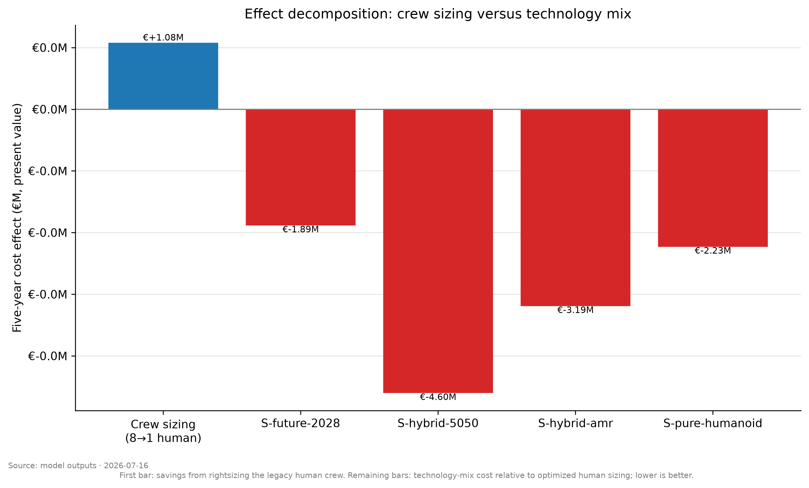
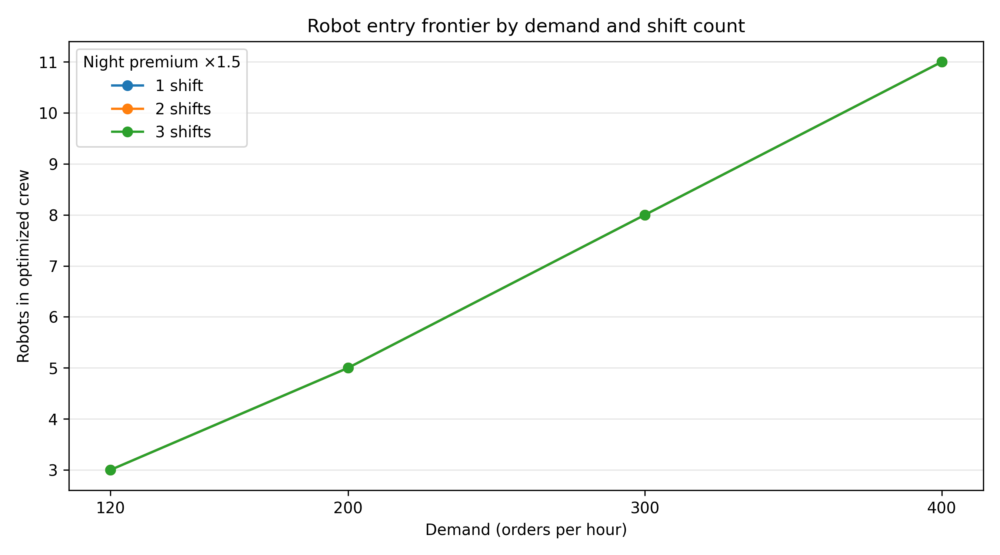

## Executive decision

The model recommends right-sizing human staffing before procuring humanoid
robots. The legacy eight-person baseline is retained as historical context, not
as a fair comparator. Robot procurement requires a case-specific operational
need, such as unfillable vacancies, beyond the wage-arbitrage model.

## Operational question

This case tests the five-year present-value cost of human, humanoid, and AMR
crews in a calibrated AutoStore-style warehouse. It is a decision model, not a
vendor performance claim.

## Evidence and external validity

The source corpus contains 2,359 household robot demonstrations. Pick-move-place
tasks are used only as a proxy for warehouse work and are derated by a 0.50–0.90
production transfer factor. Warehouse-native telemetry is the primary evidence
needed to replace that proxy.

## Method

Discrete-event simulation provides cycle-time and capacity inputs; a five-year
TCO model applies Austrian labor assumptions, robot capex, availability,
integration, maintenance, energy, wage growth, and residual value. The integer
crew optimizer imposes `rho <= 0.85` before comparing technology mixes.

## Results

{fig-alt="Five-year cost ranking"}

{fig-alt="Crew sizing and technology effects"}

The lean-human crew is the least-cost feasible option. Robot-inclusive options
remain useful operational alternatives, but cost more at the modeled demand.

## Uncertainty and value of information

Common-random-number Monte Carlo samples quantify output intervals and rank
probabilities. Partial EVPI identifies which continuous uncertainty most merits
measurement before a procurement decision; it is an estimator, not a guarantee
of realized savings.

## Demand and shift frontier

{fig-alt="Robot entry frontier by demand and shifts"}

The frontier sweeps demand and separately staffed shift counts, including the
configured night-shift wage premium.

## Limitations and ethics

The model excludes warehouse-native failure telemetry, labor scarcity value,
and downstream service effects. It supports workforce planning; it does not
recommend replacing people or making employment decisions about individuals.

## Reproduction and release

Run the documented quickstart for a synthetic, data-independent calculation.
The committed `governance/REPRODUCTION_LOG.md` is an agent surrogate that
satisfies the machine-checkable F-230 contract (`scripts/check_repro_log.py`);
a true third-party fresh-clone run remains `BLOCKED-ON-USER` and is not claimed
here. For a release, follow `governance/RELEASE_CHECKLIST.md`, archive the cited
version, and obtain external review before representing this pack as reviewed.

## References

- `PROJECT_CHARTER.md`
- `governance/SENSITIVITY.md`
- `governance/LIMITATIONS.md`
- `governance/REFERENCES.md`
