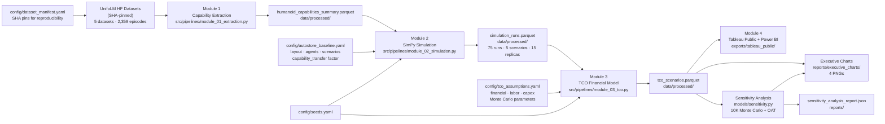

# Data Lineage

This diagram shows the end-to-end data flow for the warehouse_humanoid_tco pipeline.

## Key files

| Artifact | Path | Produced by |
|---|---|---|
| Raw episodes | `data/raw/*/` | HuggingFace download (`scripts/download_data.py`) |
| Capabilities summary | `data/processed/humanoid_capabilities_summary.parquet` | Module 1 |
| Simulation runs | `data/processed/simulation_runs.parquet` | Module 2 |
| TCO scenarios | `data/processed/tco_scenarios.parquet` | Module 3 |
| OAT sensitivity | `data/processed/sensitivity_oat_results.parquet` | Module 3 sensitivity |
| MC samples | `data/processed/sensitivity_mc_samples.parquet` | Module 3 sensitivity |
| Executive charts | `reports/executive_charts/*.png` | Module 3 + scripts |
| Tableau CSVs | `exports/tableau_public/*.csv` | Module 4 |

## Reproducibility

All outputs are deterministically reproducible given the same inputs and seed (`config/seeds.yaml`). The weekly reproducibility CI (`reproducibility.yml`) runs `make all` twice and compares output hashes.
