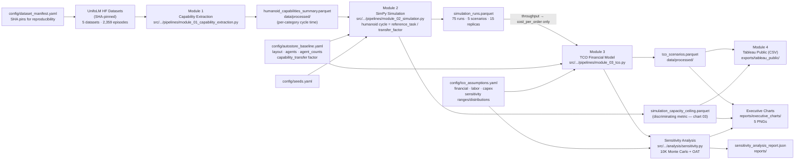

# Data Lineage

This diagram shows the end-to-end data flow for the warehouse_humanoid_tco
pipeline. Edges reflect *actual* data dependencies in the code; where a
component is computed but does not flow into a downstream result, the edge says
so explicitly (see the note on TCO below).

### How the TCO result is actually driven

The 5-year NPV per scenario is a function of the **agent composition**
(`config/autostore_baseline.yaml::scenarios.agent_counts`) and the **financial
assumptions** (`config/tco_assumptions.yaml`, wired in via
`module_03_tco.build_financial_params`). Simulation throughput does **not** drive
NPV/opex — at the modeled 120 orders/hr arrival every scenario is demand-bound
(ρ < 0.4), so throughput is ~constant. Throughput enters only the
`cost_per_order` denominator (hence the labeled `E → F` edge). The discriminating
operational metric is the capacity-ceiling sweep (`P`), not operating throughput.

## Key files

| Artifact | Path | Produced by |
|---|---|---|
| Raw episodes | `data/raw/*/` | HuggingFace download (`scripts/download_data.py`) |
| Capabilities summary | `data/processed/humanoid_capabilities_summary.parquet` | Module 1 |
| Simulation runs | `data/processed/simulation_runs.parquet` | Module 2 |
| Capacity ceiling | `data/processed/simulation_capacity_ceiling.parquet` | Module 2 |
| TCO scenarios | `data/processed/tco_scenarios.parquet` | Module 3 |
| OAT sensitivity | `data/processed/sensitivity_oat_results.parquet` | `analysis/sensitivity.py` |
| MC samples | `data/processed/sensitivity_mc_samples.parquet` | `analysis/sensitivity.py` |
| Executive charts | `reports/executive_charts/*.png` (5) | Module 4 + `scripts/generate_tornado_chart.py` |
| Tableau CSVs | `exports/tableau_public/*.csv` | Module 4 |

## Reproducibility

All outputs are deterministically reproducible given the same inputs and seed
(`config/seeds.yaml`). The weekly reproducibility CI (`reproducibility.yml`) runs
`make all` twice and compares output hashes.
