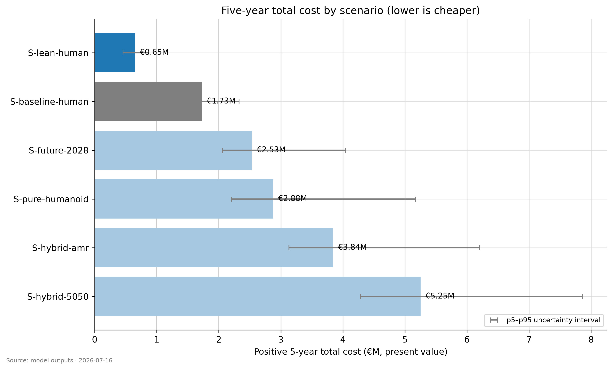
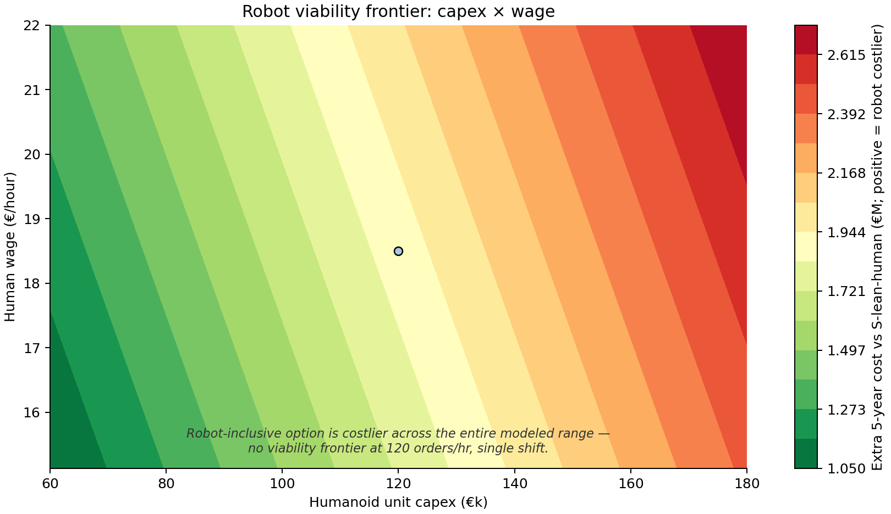

---
params:
  tco_report: reports/module_03_tco_report.json
  sensitivity_report: reports/sensitivity_analysis_report.json
title: "Warehouse humanoid TCO — decision exhibits"
format:
  revealjs:
    slide-number: true
  typst:
    papersize: a4
    margin:
      x: 1.5cm
      y: 1.5cm
---

```{python}
#| echo: false
import json
from pathlib import Path

# Quarto sets cwd to the QMD directory (reports/) during render.
HERE = Path.cwd()
REPORTS = HERE if (HERE / "module_03_tco_report.json").exists() else HERE / "reports"
tco = json.loads((REPORTS / "module_03_tco_report.json").read_text(encoding="utf-8"))
sensitivity = json.loads(
    (REPORTS / "sensitivity_analysis_report.json").read_text(encoding="utf-8")
)
rows = {row["scenario_id"]: row for row in tco["scenario_results"]}
lean = rows["S-lean-human"]["npv_eur"]
future = rows["S-future-2028"]["npv_eur"]
```

## Right-size people now; defer humanoid procurement

S-lean-human costs €647K over five years and is the lowest-cost feasible
scenario (3 humans after F-237 pick-lines scaling). The least-cost
robot-inclusive case, S-future-2028, costs €2.533M and remains above the
human baseline.

{width=90%}

## The old eight-human baseline is not the decision baseline

The retained baseline is a transparent legacy reference. Fair comparison starts
with a demand-sized crew under the ρ≤0.85 constraint.

## Robot ranking: S-future-2028 leads, but does not win overall

```{python}
#| echo: false
f"Robot-only leader: S-future-2028 ({future:,.0f} EUR NPV); lean-human: {lean:,.0f} EUR."
```

## Integration makes hybrid-AMR worse, not better

S-hybrid-amr carries the €200K system-integration cost retained under F-222 and
is costlier than S-future-2028 despite its AMR operating design.

## Capacity is feasible; cost is the discriminating result

At modeled demand, all published scenarios are demand-bound. Capacity-ceiling
analysis establishes feasibility; it does not create robot savings.

## Transfer from household demonstrations is the largest validity risk

The source episodes are not warehouse tasks. A 0.50–0.90 transfer factor
conservatively translates capability, but local telemetry should replace it.

## Wage and capex do not reverse the published decision grid

```{python}
#| echo: false
sensitivity["decision_flip_thresholds"]["S-future-2028"]["interpretation"]
```

See chart 07 for the capex × wage frontier and chart 08 for capex × transfer.

{width=90%}

## Sensitivity is paired and transparent

Monte Carlo uses common random numbers across scenarios. Sobol-style values are
coarse-grid variance proxies, explicitly not full interaction estimates.

## Decision gate: evidence required before capital commitment

Measure warehouse task cycle times, robot availability, integration scope, and
unfilled-vacancy cost in a local pilot; then rerun the model.

## Audit trail and challenge path

The decision memo, data lineage, raw report JSON, assumptions register, and
objection FAQ are all versioned in this repository.
